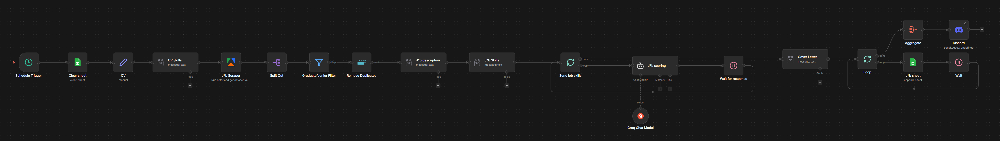
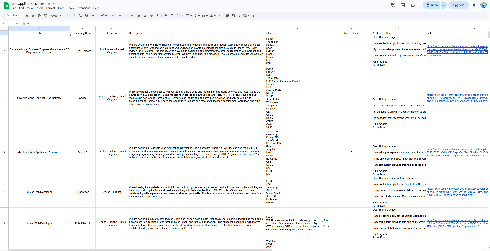

# koralabs-n8n-workflows

My personal automation suite using agentic AI and workflows built with n8n. This repository contains various automation workflows that I've built to streamline daily tasks and enhance productivity.

## 📁 Workflows

### Job Scraper 🎯

A powerful automated job application pipeline that scrapes job listings, analyzes them for compatibility with your profile, generates cover letters, and scores opportunities.

**Features:**
- 🤖 AI-powered job analysis and scoring
- ✍️ Automatic cover letter generation
- 📊 Smart job filtering (Junior/Graduate roles)
- 🔍 Skills extraction from job descriptions
- 📈 Compatibility scoring (0-5 scale)
- 📝 Job summarization
- 💬 Discord notifications for new matches
- 📅 Automated scheduling (weekly)

**Workflow Overview:**

The Job Scraper workflow runs on a schedule (every week) and:

1. **Clear Sheet** - Prepares the Google Sheets spreadsheet for new data
2. **CV** - Stores your CV information for AI processing
3. **CV Skills** - Extracts all technical skills from your CV
4. **J*b Scraper** - Scrapes jobs from multiple platforms
5. **Split Out** - Organizes job data
6. **Graduate/Junior Filter** - Filters for suitable roles
7. **Remove Duplicates** - Ensures unique job listings
8. **Job Description** - Summarizes each job role (2-3 sentences)
9. **Job Skills** - Extracts required skills from job descriptions
10. **Send Job Skills** - Splits data for parallel processing
11. **Cover Letter** - Generates tailored cover letters for each job
12. **Job Scoring** - AI compatibility scoring (0-5)
13. **Loop & Aggregate** - Processes all jobs and prepares output
14. **Wait** - Delays between job processing
15. **Job Sheet** - Appends jobs to Google Sheets
16. **Discord** - Sends notifications for new matches

**Integration with AI Services:**
- **Ollama** - Local LLM for CV skills extraction, job summarization, and cover letter generation
- **Groq API** - Fast language model for job scoring
- **Apify** - Web scraping capabilities
- **Google Sheets** - Data storage and tracking
- **Discord** - Real-time notifications

**Workflow Diagram:**

```
Schedule Trigger → Clear Sheet → CV → CV Skills → Job Scraper → Split Out → Graduate/Junior Filter → Remove Duplicates → Job Description → Job Skills
          ↓                                                          ↓
        CV Skills -------------------------------------------------> Send Job Skills → Cover Letter → Job Scoring → Wait for Response → Send Job Skills → Loop → Aggregate → Discord → Wait → Job Sheet
```

**Screenshots:**





**Prerequisites:**
- n8n instance (self-hosted or cloud)
- Google Sheets account with OAuth credentials
- Discord webhook for notifications
- Apify account
- Ollama account (for local LLM)
- Groq API account
- CV stored in the workflow

**Setup Instructions:**
1. Import the `Job Scraper/Job Scraper Workflow.json` file into your n8n instance
2. Configure credentials for Google Sheets, Discord, Apify, Ollama, and Groq
3. Update the schedule trigger to match your preferences
4. Enter your CV data in the "CV" node
5. Add your CV to n8n as a credential or node
6. Activate the workflow

**Output:**
- Google Sheet with analyzed jobs, summaries, cover letters, and scores
- Discord notifications for high-scoring matches

---

## 🛠️ Technologies Used

- **n8n** - Workflow automation platform
- **Ollama** - Local LLM inference
- **Groq API** - Fast language model processing
- **Apify** - Web scraping services
- **Google Sheets** - Data management
- **Discord** - Notifications

## 📚 n8n Documentation

n8n is an open-source workflow automation tool that lets you connect different services and automate tasks. Key features include:

- **Visual Workflow Builder** - Drag and drop interface
- **200+ Integrations** - Connect with popular apps and services
- **AI/LLM Nodes** - Native support for language models
- **Custom Functions** - JavaScript execution
- **Webhooks** - Trigger workflows from external sources
- **Split in Batches** - Process large datasets efficiently
- **Aggregate Node** - Combine processed items
- **Error Handling** - Retry logic and error nodes

**Official Documentation:**
- [n8n Documentation](https://docs.n8n.io)
- [n8n Community](https://community.n8n.io)

**Getting Started with n8n:**
1. Install n8n via Docker: `docker run -it --rm --name n8n -p 5678:5678 -v ~/.n8n:/home/node/.n8n n8nio/n8n`
2. Access the web interface at `http://localhost:5678`
3. Import workflows from JSON files
4. Configure credentials and integrations
5. Activate workflows and monitor execution

## 🚀 Contributing

Feel free to fork this repository and modify the workflows to suit your needs. Contributions and improvements are welcome!

## 📄 License

This repository is provided as-is for personal automation purposes.

## 👤 Author

**Aryan Kora**
- GitHub: [Aryboy240](https://github.com/Aryboy240)
- Linktree: [https://linktr.ee/AryanKora](https://linktr.ee/AryanKora)
- Contact: Aryan240@outlook.com

---

## 🔗 Useful Resources

- [n8n GitHub](https://github.com/n8n-io/n8n)
- [n8n Tutorials](https://www.youtube.com/c/n8nIO)
- [Apify Documentation](https://apify.com/docs)
- [Ollama Documentation](https://ollama.ai)
- [Groq API Docs](https://groq.com/docs)

---

*Note: This repository contains personal automation workflows. Always ensure you comply with the Terms of Service of the platforms you're integrating with.*